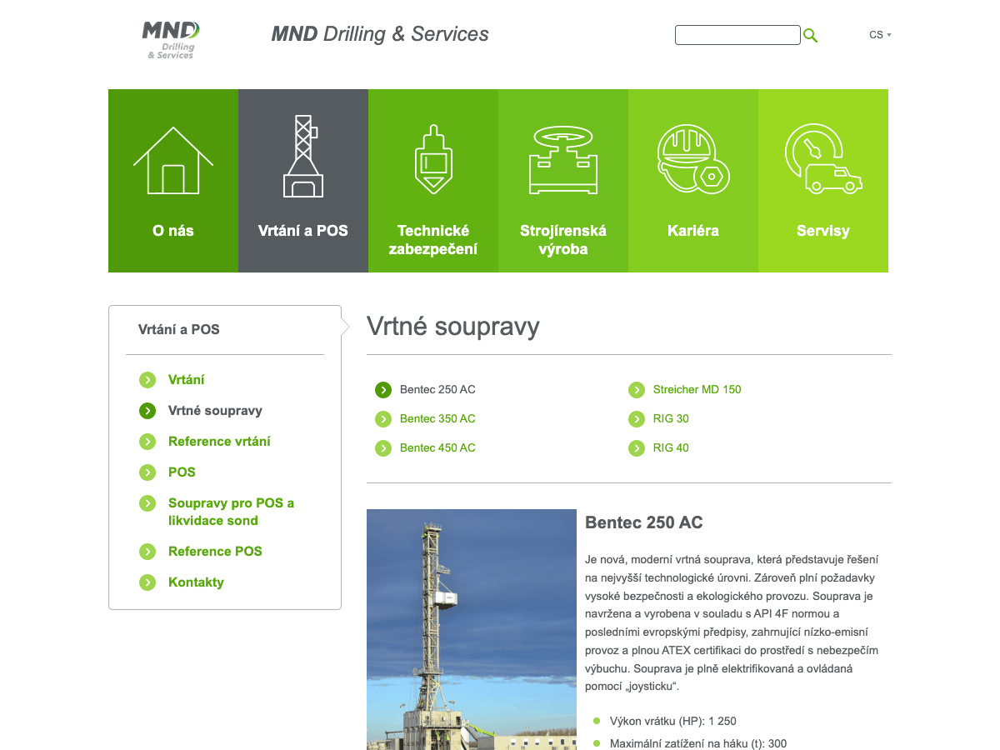

# MND Drilling — WordPress šablona a plugin

[](https://github.com/elvisek2020/wp-theme_mnddrilling/releases/latest)


Vlastní šablona a doprovodný plugin pro firemní web [www.mnd-drilling.eu](https://www.mnd-drilling.eu) (MND Drilling & Services a.s.) — vzhled původní šablony z roku 2022, ale responzivní, bez jQuery, bez build kroku a bez externích služeb (Google Analytics jen se souhlasem návštěvníka).



| Balíček | Typ | Popis |
|---|---|---|
| **MND Drilling** (`theme/mnddrilling`) | šablona | vzhled webu: titulka s dlaždicemi divizí, stránky divizí s podmenu, katalog techniky, kariéra |
| **MND Drilling Core** (`plugins/mnddrilling-core`) | plugin | funkce nezávislé na šabloně: typy obsahu, bezpečnost, obrázky, údržba |

Obojí se vydává společně se stejným číslem verze a aktualizuje se přímo z GitHub Releases.

---

## Šablona MND Drilling

**Vzhled**
- Stejný vzhled jako původní šablona: logo a název v hlavičce, slider na titulce, zelené dlaždice divizí, podmenu sekce v rámečku se šipkami, tmavá patička s Compliance Hotline
- Na mobilu dlaždice po dvou, zelený panel s hledáním a jazykem, výběr podstránky; ikony dlaždic se na displejích s vysokým rozlišením už nerozpadají
- Katalog techniky (vrtné soupravy, vybavení) a management: výběr položky nahoře, medailonek s fotkou pod ním; odkazy `#item-ID` fungují dál
- Volné pozice se stránkováním, detail pozice s tlačítky „Mám zájem o tuto pozici“ a „Zpět na výpis“
- Formulář „Zájem o pozici“ s předvyplněnou pozicí a tlačítky „Přiložit“, čitelné „Odeslat“ v osobním dotazníku
- Prohlížeč obrázků z odkazů v textu, tisková verze bez navigace

**Technicky**
- Hybridní šablona: PHP šablony a `theme.json`, moduly v `inc/` jdou vypnout jednotlivě
- Čeština a angličtina přes Polylang, texty šablony jdou přeložit v *Jazyky → Překlady textů*
- SEO: meta description, Open Graph, JSON-LD; česká typografie (pevné mezery)
- Google Analytics 4 s vlastní cookie lištou — načte se jen se souhlasem a jen když je vyplněné ID (převezme se z MonsterInsights)

**Nastavení** — *Vzhled → Přizpůsobit → MND Drilling*

| Sekce | Volby |
|---|---|
| MND Drilling | interval slideru na titulce, Google Analytics 4 ID |

Dlaždice a menu v patičce se spravují ve *Vzhled → Menu*, adresa a kontakty v patičce ve *Vzhled → Widgety*, obrázky slideru ve *Slidy*. Podrobnosti v [`theme/mnddrilling/README.md`](theme/mnddrilling/README.md).

---

## Plugin MND Drilling Core

Nahrazuje 4 dřívější pluginy (Simple Login Log, Server IP & Memory Usage, Advanced Custom Fields, Simple Custom Post Order) a typy obsahu ze staré šablony. Funguje nezávisle na šabloně, každou funkci jde vypnout v *Nastavení → MND Drilling Core*.

| Oblast | Co dělá |
|---|---|
| Obsah | typy obsahu Slidy, Historie, Společnosti, Volné pozice, Dokumenty, Položky, Oblasti a Lidé a jejich kategorie – stejné názvy a adresy jako dřív |
| Pole | dokumenty ke stažení u stránky, soubor dokumentu, kategorie položek, rozmezí let a země – ve stejných polích jako ACF, data zůstávají |
| Pořadí | řazení podle pořadí na webu a přetahování řádků v přehledech administrace |
| Volné pozice | kategorie s kontaktními e-maily (*Volné pozice → Kategorie a e-maily*) a výběr kategorie u pozice |
| Přihlášení | omezení pokusů o přihlášení, log přihlášení (*Nástroje → Log přihlášení*), poslední přihlášení u uživatelů |
| Bezpečnost | vypnuté XML-RPC a editor souborů, skrytá uživatelská jména a verze WordPressu, bezpečnostní HTTP hlavičky |
| Obrázky | nahrané JPG a PNG se uloží rovnou jako WebP, převod starších obrázků v Údržbě webu |
| SEO | sitemap s datem změny a bez uživatelů, `/llms.txt` s přehledem stránek obou jazyků |
| Aktualizace | automatické aktualizace WordPressu a pluginů podle nastavení, plugin i šablona z GitHub Releases |
| Admin | informace o serveru v patičce administrace, widget Zdraví webu na Nástěnce |

**Údržba webu** — *Nástroje → Údržba webu*
- Přehled databáze (velikost tabulek, autoload) a optimalizace, úklid revizí, konceptů, koše a transientů
- Největší soubory, nepoužité obrázky a rozbité interní odkazy
- Převod starších obrázků na WebP (soubory i odkazy v obsahu, staré adresy přesměruje 301)
- Úklid po odebraných pluginech a staré šabloně: tabulky, volby, metadata, role i složky jdou nejdřív do karantény

---

## Požadavky

- WordPress 6.6+ (testováno do 7.1)
- PHP 7.4+ (doporučeno 8.x) s podporou WebP v GD nebo Imagick
- Polylang (vícejazyčnost CZ / EN)

## Instalace

1. Stáhněte `mnddrilling.zip` a `mnddrilling-core.zip` z [posledního vydání](https://github.com/elvisek2020/wp-theme_mnddrilling/releases/latest).
2. *Pluginy → Přidat nový → Nahrát plugin* → `mnddrilling-core.zip` → Aktivovat (funguje i nad původní šablonou).
3. *Vzhled → Motivy → Přidat nový → Nahrát motiv* → `mnddrilling.zip` → Živý náhled → Aktivovat. Přiřazení menu se převezme samo.
4. Vypněte pluginy, které plugin a šablona nahrazují (Advanced Custom Fields až po přepnutí šablony – stará šablona ho potřebuje).
5. *Nástroje → Údržba webu → Pozůstatky odebraných pluginů* → do karantény.

## Aktualizace

Šablona i plugin si nové vydání najdou samy. Stačí *Nástěnka → Aktualizace → Zkontrolovat znovu* a aktualizovat.

---

## Vývoj

```
theme/mnddrilling/          šablona (podrobnosti v theme/mnddrilling/README.md)
plugins/mnddrilling-core/   plugin
mu-plugins/                 pomůcky jen pro lokální vývoj — nenasazovat
dev/                        lokální WordPress v Dockeru (dev/README.md)
tools/                      pomocné skripty
.github/workflows/          sestavení vydání
```

## Vydání nové verze

Šablona i plugin mají společnou verzi.

1. Zvyšte `Version:` v `theme/mnddrilling/style.css` **i** v `plugins/mnddrilling-core/mnddrilling-core.php` a doplňte [`CHANGELOG.md`](CHANGELOG.md).
2. Commit a anotovaný tag:
   ```bash
   git add -A && git commit -m "X.Y.Z: …"
   git status                      # musí být čisto
   git tag -a vX.Y.Z -m "X.Y.Z" && git push && git push --tags
   ```
3. GitHub Action ověří, že tag odpovídá verzím, zkontroluje syntaxi PHP, sestaví `mnddrilling.zip` a `mnddrilling-core.zip` a vytvoří Release.

## Licence

[GPL-2.0-or-later](https://www.gnu.org/licenses/gpl-2.0.html) · © Zdeněk Král ([ElvisEK](https://www.elvisek.cz))
